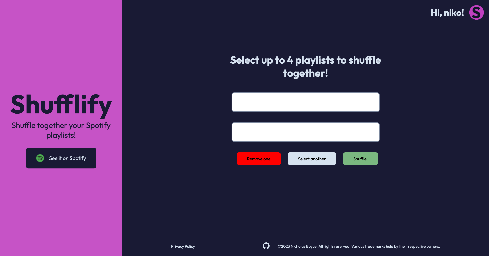

# Shufflify

[shufflify.app](https://shufflify.app)

## Author

Nicholas Boyce

## About

An app which allows the user to log into their Spotify account, shuffle selected playlists, and add the result to their Spotify account as a combined playlists. Premium users can also add the songs directly to their queue. 

### Stack

Frontend: HTML, CSS, Vanilla JS
Backend: None
APIs: Spotify
Authentication Method: OAuth pkce
Build Tool: Vite

### Screenshots

## Acknowledgements

I took some inspiration from the [mixmello project](https://www.mixmello.com), and created this project in response to community requests on Spotify for a feature that would let users mix together playlists of their choice. 

